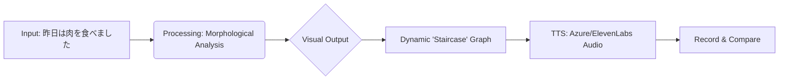

# PitchLab JP - Product Vision & US Market Strategy

> The "Grammarly of Japanese Pronunciation"

---

## 1. Core Concept

Just as no one sends an important email without checking Grammarly, **no serious Japanese learner should speak a new sentence without "passing it through PitchLab JP"**.

- It doesn't teach *what* to say (Duolingo does that).
- It teaches you **how not to sound like a robot or a confused foreigner**.

---

## 2. The Problem

**OJAD (Online Japanese Accent Dictionary)** is the bible for serious students, but:
- The interface is outdated and punitive.
- It generates static PDFs/images.
- Lacks fluid audio.
- Zero pronunciation feedback.

---

## 3. The Solution

### Main Flow (Web App)

1.  **Input**: User pastes a Japanese sentence.
2.  **Processing**: Morphological analysis identifies the pitch of each word.
3.  **Visual**: Dynamic "staircase" graph over kana/kanji.
4.  **TTS**: Crystal clear audio via Azure/ElevenLabs.
5.  **Record & Compare**: User records and sees their audio wave overlaid on the native pitch.

### Product Suite

#### 1. Web App - The Study Hub
- Modern dictionary (OJAD replacement).
- Sentence editor with real-time pitch visualization.
- Changed a particle? The graph updates instantly.

#### 2. Browser Extension - The "Lock" on the User
The product **lives where the user already is**:

| Context | Functionality |
| :--- | :--- |
| **Crunchyroll/Netflix** | Real-time pitch graph on subtitles |
| **NHK News** | "Staircase" graph over paragraphs |
| **Anki** | Automatically generates audio + graph image |
| **Any Website** | Select text → Right Click → Mini-PitchLab JP |

#### 3. Record & Compare - The "Guitar Hero" of Fluency
- User sees the "road" (native pitch).
- "Drives" their own voice over it.
- System gives a **Melody Score**.
- It's not about hitting words, it's about **hitting the music of the sentence**.

---

## 4. US Market Strategy (Strategic Contribution)

To succeed in the American market, PitchLab JP must transition from a "tool" to a "fluency companion". The US market values convenience, speed, and tangible results ("sounding native").

### A. Market Positioning: "Unlock the Music of Japanese"
American learners often struggle most with the "flatness" or "intonation" of Japanese because English is stress-accented.
- **Hook**: "Stop sounding like an American. Start sounding Japanese."
- **USP**: The *only* tool that gives you visual feedback on your intonation in real-time.

### B. Target Audience Expansion (US Specifics)
1.  **The "AJATT" / "MIA" Community (Mass Immersion Approach)**:
    - Huge in the US (Matt vs Japan followers).
    - They are obsessed with native audio and pitch accent.
    - **Strategy**: Position as the *ultimate* tool for "sentence mining" (creating Anki cards from media).
2.  **Wanikani Users**:
    - Wanikani (kanji learning) has a massive, paid user base in the US.
    - **Strategy**: Build a "Wanikani Pitch Plugin" or similar integration. "You know the Kanji, now learn to say it."
3.  **JET Program Participants & Expats**:
    - People moving to Japan who need to sound professional.
    - **Strategy**: "Business Japanese" pitch packs (Keigo intonation).

### C. Feature Set for US Growth ("Viral Features")
1.  **"Share Your Score" (Gamification)**:
    - After the "Guitar Hero" mode (Record & Compare), generate a shareable card image: "I hit 98% pitch accuracy on this anime quote!".
    - heavily leverages the "show off" culture of social media.
2.  **TikTok/Shorts Mode**:
    - A feature to record a video with the pitch overlay on top of the user's face.
    - Perfect for content creators showing off their progress.
3.  **"Accent Eraser" Challenge**:
    - A specific module that targets common American mistakes (e.g., stress-accenting foreign words).

### D. Marketing Channels & Sales
1.  **Influencer Partnerships (The "Dogen" Effect)**:
    - **Dogen** is the authority on Pitch Accent in the West. Getting him to review or sponsor is the #1 goal.
    - **Micro-influencers**: "Study with me" YouTubers.
2.  **Community Infiltration**:
    - **Reddit (r/LearnJapanese)**: Do not just post ads. Post "Technical Deep Dives" on how the pitch visualization algorithm works. Dev-logs gain trust.
    - **Discord Communities**: Create a bot that graphs pitch for users in chat.
3.  **Pricing Psychology for the US**:
    - **Monthly**: $9.99 (Psychological barrier under $10).
    - **Annual**: $79 (2 months free).
    - **Lifetime Deal (Launch Only)**: $149. Americans love a "one-and-done" deal for beta software. It creates cash flow for development.

### E. SEO & Content Strategy
- **Keywords**: "Japanese Pitch Accent Calculator", "OJAD alternative", "How to sound native in Japanese".
- **Blog Content**: "Why your Japanese sounds robotic (and how to fix it)", "The hidden rules of Pitch Accent".

---

## 5. Technical Stack

### Backend (Python/FastAPI)
- **Tokenization**: `fugashi` + `unidic`
- **Pitch Inference**: `tdmelodic` (Neural network for neologisms)
- **Audio Analysis**: `Parselmouth` (Praat) + `Librosa`
- **TTS**: Azure AI Speech (Production) / ElevenLabs (Prototyping)

### Frontend
- **MVP**: Streamlit (Validation)
- **Production**: Next.js + React

---

## 6. Business Model

| Tier | Features | Price (Est) |
| :--- | :--- | :--- |
| **Free** | Web Dictionary, Limited lookups/day, No history | $0 |
| **Pro** | Unlimited Extension, Anki Integration, History, AI Feedback, High-Fi TTS | $9-15/mo |
| **Enterprise** | Teacher Dashboard, Student Tracking, Dedicated API | Custom |

## 7. Roadmap to Launch

1.  **Phase 1 (MVP)**: Web App with core `/analyze` and basic visualizer.
2.  **Phase 2 (TTS)**: Integrate Azure AI Speech.
3.  **Phase 3 (Record & Compare)**: The "Killer Feature" for engagement.
4.  **Phase 4 (Browser Extension)**: The "Retention Feature".
5.  **Phase 5 (Anki Integration)**: The "Viral Feature" for the hardcore community.

---

## 8. Risks (US Market Focused)
1.  **"Pitch Accent doesn't matter" crowd**: Some learners believe pitch accent is unnecessary.
    - *Mitigation*: Show "minimal pairs" examples (Hashi vs Hashi) where meaning changes. Use humor in marketing.
2.  **Privacy (CCPA)**: US users are sensitive to voice recording privacy.
    - *Mitigation*: Clear privacy policy stating voice data is processed briefly or locally and not sold.
3.  **Subscription Fatigue**: Americans have too many subscriptions.
    - *Mitigation*: The Lifetime Deal option during launch.

---

## 10. Success Metrics (KPIs)
- **North Star**: Daily Active "Speakers" (Users who use Record & Compare).
- **Viral Coefficient**: Shares of "Melody Scores" on social media.
- **Anki Exports**: Number of cards generated (proxy for "serious usage").
